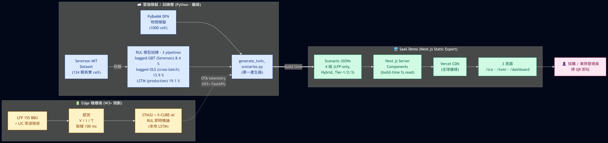

# Sysblade HyperBuffer

> **AI 機房混合 BBU + 嵌入式電池數位孿生 SaaS** · ATCC 第 23 屆全國大專院校創業競賽 · 議題 C13(系統電 Sysgration)

[**Live demo**](https://sysblade-atcc.vercel.app) · [**技術白皮書 v1.3**](docs/whitepaper.md) · [**精煉版 v1.3**](docs/whitepaper_restructured.md) · [**實作計畫 v2.0**](docs/BBU_IMPLEMENTATION_PLAN.md) · [**RD Brief**](docs/RD_BRIEF.md) · [**Investor Brief**](docs/INVESTOR_BRIEF.md)

## 專案狀態(2026-07)

**競賽已結束 — repo 進入 archive / maintenance 模式。** 本倉儲保留完整的競賽成果與可重現工程資產;所有 headline 數字由自動化驗證鏈鎖定(見下方「驗證鏈總覽」),`make verify` 一條命令可全部重跑。

| 階段 | 時間 | 交付 |
|---|---|---|
| 初賽 | 2026-05-05 | 企劃書 v2.2 + 軟體三件套上線(/tco · /twin · /dashboard) |
| 複賽 pivot | 2026-05-27 | 8S 實機 demonstrator(v1.x M1-M4)pivot 至 **twin-first 驗證鏈 V1-V6**;硬體全數退貨 |
| 複賽 | 2026-06-11 | 白皮書 v1.3 + `make verify` CI gate + 業師四層驗證(技術/財務/供應鏈/專利) |
| 全國決賽 | 2026-07 | V7 pack 篩檢 + V8 監督層閉環 + fleet 推論切換 production TCN;完賽 |

---

## 真實產品修訂對照(勘誤 · 2026-06)

> 本 repo 為 ATCC 競賽期成果。在「真正量產上市」的端到端審視下,以下五點需與真實產品規格一致更正;完整真實產品審視 / 料件 BOM / 產品規格 / 量產企劃見 `docs/product_realization/`。

| # | 競賽期原陳述 | 更正(真實產品基準) |
|---|---|---|
| 1 | Tier-A「LIC 鋰離子電容」錨定 Eaton XLR | Eaton XLR-48R6167-R 官方 datasheet 為 **EDLC 超級電容**;**量產 Tier-A 改採真 LIC(Musashi ULTIMO CPQ3300SD)** |
| 2 | 5.7× / 3.5× 削峰 | **±30%/100ms reference 波形理想無損耗上界、非壽命倍率**;含 DC-DC 損耗後典型 **2.4–3.9×、>100Hz 退到 ~1.5×** |
| 3 | 雙向 DC-DC 前級 | OCP ORV3 禁 Oring 後 bus 放電容 → **DC-DC 為合規必要件**;sim 為開環等效,**電力電子層** closed-loop 為 EVT deliverable(監督層閉環 SOH→τ 已於 **V8** 模擬驗證,`make v8`) |
| 4 | STM32N6 NPU 推論 LSTM(54.7 µs) | Neural-ART **NPU 不支援 LSTM/GRU**;量產 RUL 改 **TCN/1D-CNN**(NPU 原生 + 可 static INT8 量化) |
| 5 | Tier-C 單晶片整合(含 OpenBMC) | M55 無 MMU 跑不了 OpenBMC;**拆三層**(BMS-AFE + safety MCU + N6 推論),BBU 走 MCTP/PLDM **不自稱 BMC** |

> 另:先發空窗已關;真實 BOM 約 v2.2 之 2.0–2.7×;認證須擴 UL 9540 / 9540A;cell 在地化以 pack 組裝為主、進口走 UFLPA。詳 `docs/product_realization/`。

---

## TL;DR

針對**北美 Tier-2/3 AI 機房 BBU 市場**的軟硬整合方案 ——
**LFP + 鋰離子電容(LIC)混合 BBU** 搭配 **Battery Digital Twin SaaS**,一次解掉:

- **GB200 毫秒級電壓瞬態** — 純電池 BBU 撐不住 50–200 ms 壓降造成下游 PSU 重啟
- **48 V → ±400 V HVDC 過渡** — Vertiv 等只賣 48 V,客戶 2027 後須 forklift 換代
- **1000+ 節 fleet 維運** — 人工巡檢 hit-rate 低,業界無公開 SaaS 提供 BBU-level RUL

**6 個關鍵數字**:5.7× 功率波動下降 · ~25 % LFP 浮充壽命優勢† · 33 % 客戶 10 年 TCO 下降 · 60 sec graceful @ 120 kW **rack** peak(**8 台 BBU 並聯 / per rack**,動態 ramp profile,業師最關注點見下) · 8.38 % RUL 預測 MAPE · 3.49× INT8 量化壓縮(完整推導見[白皮書](docs/whitepaper.md))。

> †「~25 %」的主要來源是 **BBU 低 duty 排程**(§G.3 `duty_factor=0.33`,~50 cyc/yr vs Severson 1C/1C 實驗室 cadence),**不是** hybrid 拓樸貢獻;hybrid 拓樸的 per-Ah 損傷差由 rainflow + Wang 2011 獨立驗證(`aging_rainflow_validation.json`)估算為 worst-case ~5 %、demo waveform 近於 neutral。

---

## 驗證鏈總覽(V1-V8 + XCHECK)

每個對外 headline 數字都掛在一條可重跑的驗證鏈上;本地 `make verify` 一鍵全跑(含 V1,需 Severson 資料),CI 於每次 push 自動執行 V2-V5 + V8 + XCHECK(V1 需 8 GB Severson 原始資料,僅本地執行)。

| 鏈 | 驗證什麼 | 判準 / 結果 | Artifact |
|---|---|---|---|
| **V1** | PyBaMM Prada2013 vs Severson 實測放電曲線 | RMS 誤差 **2.15 %**(門檻 ≤ 5 %)[v] | `data/processed/pybamm_lfp_fit_error.json` |
| **V2** | LIC 一階 RC 模型 vs Eaton XLR datasheet(含 4 條非線性延伸) | droop 低估 ≤ **2.93 %**(門檻 10 %)[v] | `scripts/eval_lic_rc_fit.py` |
| **V3** | 整 rack 60 s graceful 動態模擬(含熱模型) | 電壓 / 溫度 / C-rate 全程合規,DoD 2.66 % [v] | `apps/web/public/scenarios/rack_60s_graceful.json` |
| **V4** | N-1 容錯:t = 15 s 拔除 1 台 BBU | 剩 7 台撐滿 60 s,單台負載 +14 % 仍合規 [v] | `apps/web/public/scenarios/rack_n_minus_1.json` |
| **V5** | Severson → BBU duty 跨工況 transfer | MAPE 9.04 % → **80.20 %**(誠實揭露之限制)| `data/processed/severson_transfer_mape.json` |
| **V6** | `make verify` reproducibility orchestrator | **6/6 chains PASS** | `data/processed/verify_all_report.json` |
| **V7** | 15S pack 不均衡篩檢(cell spread + 熱梯度 + 2 芯並聯電容 A/B) | 最弱電芯瞬態負擔 **−13.3 %**(screening,非 gate)| `apps/web/public/scenarios/pack_imbalance.json` |
| **V8** | 監督層閉環(SOH → τ 自適應) | aged pack 峰值 6.06C 越過 6C 設計點 → 閉環回 **5.47C** [v] | `apps/web/public/scenarios/adaptive_split.json` |
| **XCHECK** | 白皮書 / README / UI 數字交叉一致 | **43/43 assertions** [v] | `scripts/check_whitepaper_numbers.py` |

---

## 業師最關注點:60 秒 graceful 架構 ── 化解「48C 不可行」誤讀

**先說結論**:Sysblade per-rack BBU 是 **8 台並聯**架構,**每台 BBU 2.5 kWh / 15 kW peak,
rack 總能量 20 kWh**;rack peak 120 kW 對應每台 BBU **6C peak per cell(非 48C)**;
60 秒 graceful 是 **動態 ramp power profile**(t = 0–2 s 由 LIC + LFP 共同承擔
6C peak,t = 2–60 s 由 LFP 以 1.5C 連續放電撐至結束),完全落在車規 LFP cell
datasheet 不同規格條目允許區內。

### 為什麼這節獨立成段(避免 unit-mixing 誤讀)

讀者若用 **單台 BBU 容量(2.5 kWh)**除以**整 rack 功率(120 kW)**心算
「2.5 kWh ÷ 120 kW = 75 秒 → 48C → LFP 物理不可行」,會錯誤推導出致命矛盾。
**這是 unit-mixing**:2.5 kWh 是單台 BBU,120 kW 是整 rack(8 台並聯)。

| 心算誤讀 | 正確算法 |
|---|---|
| 2.5 kWh ÷ 120 kW = **75 秒 → 48C** [x] | **20 kWh ÷ 120 kW = 600 秒理論** / 60 秒承諾,**8 倍 DoD 餘量,per-cell 6C peak** [v] |

來源交叉一致(架構先行於文件):
- `scripts/generate_twin_scenarios.py:65` `N_BBU_PER_RACK = 8` · `LFP_PACK_KWH = 2.5` · `TARGET_PEAK_C_RATE = 6.0`
- `apps/web/src/lib/tco.ts:4` 「Per-rack 10-year cost (USD) for a **100 kW-class rack with 8 BBUs**」

### 60 秒功率曲線(動態 ramp,非平直 120 kW)

| 時段 | rack 負載 | 每台 BBU | per-cell C-rate | 主導機制 |
|---|---:|---:|:--:|---|
| **t = 0–500 ms** | 120 kW 滿載 | 15 kW | **6C peak** | LIC 主導(2× XLR-48-166 共 ~290 kJ usable,可單獨撐 ~2.4 秒)|
| **t = 500 ms–2 s** | 120 → 30 kW(線性 ramp)| 15 → 3.75 kW | 6C → 1.5C | BMC 觸發 GPU power-cap,LIC + LFP 共同 ramp down |
| **t = 2–60 s** | 30 kW 穩態(checkpoint + idle)| 3.75 kW | **1.5C 連續** | LFP 獨撐(LIC 已耗盡進入待機)|

60 秒總放電能量積分 ≈ **0.53 kWh per rack**,僅 rack 總容量 20 kWh 的 **2.6 %**
(留 38 倍能量餘量)。

### 車規 LFP cell datasheet 合規性

| 工作點 | 持續時間 | 車規 LFP datasheet 規格 | 結論 |
|---|---|---|---|
| **6C peak** | < 2 秒 | LG ESS B-series / Samsung SDI 高功率版 pulse 5–10C × 30 秒允許 | [v] 落在 pulse 允許區 |
| **1.5C 連續** | 58 秒 | 車規 LFP 連續放電 1–3C 規格 | [v] 連續允許區下緣 |

**沒有任何工作點需要「車規 LFP × 連續 6C × 60 秒」**(這個工作點才是 48C
誤讀的物理不可行點)。Sysblade 設計把 6C 限制在 < 2 秒 pulse、把 60 秒連續
工作點壓到 1.5C —— 兩個不同的 datasheet 規格條目,各自合規。

**完整推導**:[`docs/whitepaper_restructured.md` §2.1.1](docs/whitepaper_restructured.md)
(含拓撲層 / 時序層 / cell 工作點層 / GPU 協同 ramp / 業師預期追問與答辯六層完整防禦)。

> **授權與資料聲明**:本 repo 公開供學術透明與工程展示使用,授權詳見
> [LICENSE](LICENSE)。儀表板與孿生情境中的客戶 / 機房名稱**全為示意
> persona**,非實際部署資料(`fleet_devices.json` 的 disclaimer 欄位 +
> UI 上 SIMULATED DATA 浮水印雙重標註)。競賽提交版本明細見上方「專案狀態」。

---

## 軟體三件套

| 路由 | 功能 | 突出技術 |
|---|---|---|
| [`/`](https://sysblade-atcc.vercel.app/) | 首頁 — 5 張頭條卡 + 板塊導引 | 從 scenario JSON 動態取真實量測值 |
| [`/twin`](https://sysblade-atcc.vercel.app/twin) | Battery Digital Twin | PyBaMM DFN (LFP) + **closed-form RC (LIC, Eaton XLR datasheet anchor)** + TCN RUL(LSTM baseline)+ 90 % MC-Dropout PI 經 split conformal 縮窄 44 % + 示波器掃描動畫 + **v_lic(t) chart 顯示 UVLO 餘裕** |
| [`/tco`](https://sysblade-atcc.vercel.app/tco) | 10 年 TCO 計算器 | 4 個 slider × 3 個 preset · 純 HTML/Tailwind bar chart · **Payback period tile + 5 條 §G.3 source anchor panel** |
| [`/dashboard`](https://sysblade-atcc.vercel.app/dashboard) | 1000 台機隊 Fleet Dashboard | US fleet map + 三層服務分層 + per-device drilldown(SOH / RUL / 熱 / 操作層 metrics + **LIC bank envelope headroom bar**)· 全頁 SIMULATED DATA 浮水印 · site 名為虛擬 persona |



---

## 架構(關鍵設計決策)

**Python 物理引擎離線預跑 → JSON → Next.js build-time `fs.readFile` → static export → Vercel CDN**。

```
PyBaMM DFN simulation (Python)            scenario JSONs in two sinks:
scripts/generate_twin_scenarios.py    ─►  ├ packages/shared/scenarios/
scripts/export_lstm_onnx.py               └ apps/web/public/scenarios/
                                                      │
                                                      │ fs.readFile (build time only)
                                                      ▼
                                          apps/web Server Components
                                            → next build (static export)
                                              → out/ → Vercel CDN
```

### 物理層分層 — 為什麼 LIC 不走 PyBaMM

**LFP cell 走 PyBaMM DFN**(化學最複雜、最 critical);**LIC 側走 closed-form 一階 RC 等效模型**
(`_simulate_lic_rc()` in `scripts/generate_twin_scenarios.py`),參數錨 Eaton XLR-48-166 × 2 並聯 datasheet:

| 參數 | 值 | 來源 |
|---|---:|---|
| Bank capacitance C | 332 F | 166 F × 2 modules in parallel |
| Bank ESR | 2.5 mΩ | 5 mΩ × 0.5 (parallel) |
| V_nominal | 51.3 V | 滿電終端電壓 |
| V_min (datasheet UVLO) | 38.0 V | Eaton XLR discharge cutoff |

Demo waveform 跑出來:**worst-case droop 2.32 V**(從 51.3 → 48.98 V)、**headroom 10.98 V 到 UVLO**、
`passes_cutoff = true`。Droop 組成:**95 % 來自 ESR drop**(926 A peak × 2.5 mΩ)、5 % 來自累積電容放電
(13.31 kJ ÷ 332 F)— 換句話說 production 若需降 droop,加並聯模組(降 ESR)比加電量(加 C)有效。
**未模**:pseudo-capacitance、temperature-dependent ESR、self-discharge、electrode kinetics
(Helmholtz layer dynamics)— production 階段以 Eaton in-the-loop 量測校正。`/twin` 第 3 張 ChartCard
渲染 v_lic(t) 配紅色 dashed line 標 UVLO,業師可直接指螢幕。

---

## Quick start

```bash
# 1. Web app
cd apps/web && pnpm install
pnpm dev                                      # → http://localhost:3000

# 2. Python 環境(可選 — 跑 PyBaMM / LSTM 訓練才需要)
python -m uv venv .venv --python 3.11
.venv/Scripts/activate                        # Windows bash
python -m uv pip install -e "packages/battery-twin[dev,api]"

# 3. 重生 4 個場景 JSON(改 physics constants 後;雙寫到兩個 sink)
pnpm scenarios                                # = scripts/generate_twin_scenarios.py

# 4. 數字 cross-check gate(CI 上自動跑)
pnpm check:numbers                            # = scripts/check_whitepaper_numbers.py

# 5. Web app 完整檢查 + build
cd apps/web && pnpm check                     # typecheck + lint + check:numbers
pnpm build                                    # 推 main 之前先跑這條
```

Severson .mat v7.3 訓練資料(8.3 GB)需手動下載,流程見 [`docs/severson_download.md`](docs/severson_download.md);
資料夾 `data/raw/` 與 `data/processed/` 均 `.gitignore`(只 commit `.gitkeep` 與 4 個 derived JSON 給 number-checker 驗證)。

<details>
<summary><b>更多 reproducibility commands</b>(LSTM 重訓 / 全 sweep / INT8 量化 / cross-dataset / NPU 靜態分析)</summary>

```bash
# 重訓 LSTM + 匯出 ONNX(~3 min CPU)
python scripts/export_lstm_onnx.py            # → apps/web/public/scenarios/model_validation.json

# OLS / GBT / bagged-* 全 sweep(模型卡那張表)
python scripts/eval_severson_models.py        # → data/processed/severson_model_eval.json

# INT8 動態量化驗證(白皮書附錄 C.5,~ 30 s)
python scripts/quantize_lstm_onnx.py          # → data/processed/lstm_quantization_report.json

# Cross-dataset(Severson → NASA NMC)跨化學測試
python scripts/eval_cross_dataset.py          # → data/processed/cross_dataset_mape.json

# STM32N6 NPU 靜態 graph 分析
python scripts/onnx_static_analysis.py        # → data/processed/x_cube_ai_static_analysis.json
```

</details>

---

## 模型卡

兩條 RUL 預測管線並行,**「one model, two views」**:`/twin` Inference Walkthrough
與 `/dashboard` 1000 台 fleet RUL 共用同一個 **production TCN**(§3.4.1)推論輸出,確保兩頁面數字一致(LSTM 為文件化 baseline)。

### Severson cycle-life regression(隨機 split,10-seed median)

| 模型 | Random split MAPE | Cross-batch MAPE | R² | 備註 |
|---|---:|---:|---:|---|
| Variance OLS(1-feat / unfilt) | 17.9 % | 15.8 % | 0.57 | 重現 Severson 2019 paper 頭條 |
| Discharge OLS(5-feat) | 17.5 % | 19.9 % | 0.53 | paper Table 1 5-feat |
| Full + IR OLS(13-feat) | 14.5 % | 14.5 % | +0.08 | 加 internal-resistance,**cross-batch R² 由負轉正** |
| **Full + IR bagged-GBT(K=24, xstrict ≥400, n=134)** | **8.38 %** | 17.9 %(GBT 退化) | **0.89** | **首次達企劃書附件 B 軟體技術棧 < 10 % 承諾**;per-seed [5.93, 12.91],7/10 seeds < 10 % |
| **Full + IR bagged-OLS(13-feat / xstrict)** | 12.4 % | **13.9 %** | +0.21 | cross-batch generalisation 最佳 |

**達標**:bagged-GBT + xstrict cell filter 把 random-split median MAPE 從 14.51 % 拉到 **8.38 %**。
跨 protocol 部署改用 bagged-OLS(13.87 %),GBT 在 cross-batch 因 protocol-specific 過擬合退化。

### 序列模型(production = TCN,LSTM 為 baseline)

> **Production fleet 模型 = TCN**:`/twin`、`/dashboard` 的 fleet 推論已切換為 dilated 1D-CNN(NPU-native,無 recurrent op;QAT 後匯出為 **ONNX QDQ artifact**(`models/tcn_rul.int8.qat.onnx`,QuantizeLinear/DequantizeLinear),onnxruntime 實測 **14.54 % MAPE**、torch backend 14.68 % / R² 0.948,FP32 18.15 % / R² 0.892,勝 LSTM 19.10 %)。measured 見 `data/processed/tcn_rul_report.json` 與技術白皮書 §3.4.1。下表 LSTM 數字保留為文件化 baseline 與 regime-augmentation 反證。

> **Augmentation 反證(P1-1)**:跑 `python scripts/export_lstm_onnx.py --severson-only` 用同一條 LSTM 架構、同 seed=42、同 60/20/20 random split,只訓 138 顆 Severson 真實 cell(去掉 50 顆合成 BBU)— 結果 test MAPE **16.17 %**、R² **0.553**、conformal PI median width **793 cycles**(完整 JSON 在 `data/processed/lstm_severson_only_eval.json`)。**augmentation 把 MAPE 從 16.17 → 19.10 % 反而略升**(因為要 fit 跨 100-13,000 cycles 的大 dynamic range),R² 從 0.55 → 0.86 是因為加入長壽命 cell 後 explainable variance 比例上升。**augmentation 純粹是 regime coverage,不是 MAPE 障眼法** — 這條反證在白皮書 §3.3.8 加入,反駁「BBU 合成 cell 是不是 self-fulfilling」的合理質疑。

| 項目 | 值 | 備註 |
|---|---:|---|
| 訓練 cell 數 | **188** | 138 Severson 2019 fast-charge + 50 Severson-anchored synthetic BBU-duty(analytic decay,not PyBaMM aging) |
| Test MAPE(隨機 split) | **19.1 %** | Severson-only baseline → augment 後 span 雙 regime |
| Test R² | **0.86** | 跨 regime trade-off 後仍維持高解釋度 |
| ONNX size | FP32 219 KiB → **INT8 63 KiB(3.49× 壓縮 measured)** | 遠小於 STM32N6 1.6 MB ML FLASH;`scripts/quantize_lstm_onnx.py` 量測 |
| INT8 精度退化 | **ΔMAPE +0.10 pp**(19.10 → 19.20 %),R² 不變 | 平均預測偏移 0.57 %,STM32N6 部署的 go/no-go 證據 |
| ONNX 延遲(laptop CPU p99) | FP32 0.44 ms / INT8 0.40 ms | 50 ms 規格達標 ~125×;STM32N6 NPU 推估 27–109 µs(靜態 graph 分析,`scripts/onnx_static_analysis.py`)|
| 不確定性方法 | MC Dropout + split conformal | 100 forward passes,**raw 1910 → conformal 1075 cycles**(縮窄 44 %),test coverage 100 %、≥ 90 % 保證,校準集 37 cells held-out |

**Production 推論主力為 TCN**(§3.4.1;LSTM 為文件化 baseline);bagged-GBT 13-feat 為「Severson paper 對齊」的學術 baseline(< 10 % 承諾達標)。
**MAPE 上升是 regime gap closure 的取捨**,完整論述見白皮書 [§3.3.5](docs/whitepaper.md)。

---

## 倉儲結構

<details>
<summary><b>展開檔案樹</b></summary>

```
atcc/
├── docs/
│   ├── proposal_v2.2_additions/
│   │   └── Sysblade_HyperBuffer_Proposal_v2.2.docx  企劃書 v2.2(2026-05-06,主要繳交版本)
│   ├── whitepaper.md                            技術白皮書 v1.3(完整版)
│   ├── whitepaper_restructured.md               精煉版 v1.3(三段式)
│   ├── RD_BRIEF.md / INVESTOR_BRIEF.md           跨領域 RD / 投資人 brief(v2.0)
│   ├── BBU_IMPLEMENTATION_PLAN.md               實作計畫 v2.0(twin-first)
│   ├── MIRROR_SETUP.md / BINDER_README.md        contingency + 複賽日紙本 binder
│   ├── severson_download.md                     Severson 2019 .mat v7.3 下載 SOP
│   ├── x_cube_ai_install_sop.md                 STM32N6 X-CUBE-AI 安裝 SOP
│   └── figures/                                 架構圖 + 截圖 + 業務模型 canvas
├── apps/
│   └── web/                                     Next.js 14 三件套(static export)
│       ├── src/app/
│       │   ├── page.tsx                          /
│       │   ├── twin/page.tsx + twin-client.tsx   /twin
│       │   ├── tco/page.tsx + tco-client.tsx     /tco
│       │   └── dashboard/page.tsx + ...          /dashboard
│       ├── public/scenarios/                     PyBaMM 預跑 JSON(build-time 讀)
│       └── src/lib/{tco.ts, types.ts}            TCO 公式 + Device 型別
├── packages/
│   ├── battery-twin/                             Python: physics + ML
│   │   ├── lstm_rul/                             PyTorch LSTM + linear baseline
│   │   └── data_loaders/                         Severson + NASA + CALCE 解析器
│   └── shared/scenarios/                         JSON 雙寫 sink #2
├── notebooks/                                    EDA + 訓練 smoke test
├── scripts/
│   ├── generate_twin_scenarios.py                4 個 PyBaMM 場景 + 1000-device fleet(單一產生器,雙 sink)
│   ├── generate_full_rack_60s_sim.py             V3 整 rack 60 s graceful sim + 熱模型
│   ├── generate_n_minus_1_sim.py                 V4 N-1 BBU 容錯 sim
│   ├── generate_adaptive_split_sim.py            V8 監督層閉環(SOH → τ 自適應)sim
│   ├── generate_bbu_duty_cells.py                50 顆 Severson-anchored synthetic BBU duty cell(analytic decay)
│   ├── eval_pybamm_lfp_fit.py                    V1 PyBaMM vs Severson 實測 fit(2.15 % RMS)
│   ├── eval_lic_rc_fit.py                        V2 LIC RC vs Eaton datasheet(含非線性延伸)
│   ├── eval_severson_transfer.py                 V5 跨工況 transfer MAPE
│   ├── eval_severson_models.py                   OLS / bagged-OLS / GBT / bagged-GBT / HistGBT / stack 全 sweep
│   ├── eval_cross_dataset.py                     Severson → NASA NMC 跨化學測試
│   ├── train_tcn_rul.py · export_tcn_onnx.py     production TCN 訓練 + ONNX(QAT / QDQ)匯出
│   ├── export_lstm_onnx.py                       LSTM baseline + MC Dropout + split conformal
│   ├── quantize_lstm_onnx.py                     INT8 動態量化 + accuracy 退化 + CPU latency 量測
│   ├── onnx_static_analysis.py                   STM32N6 NPU 靜態 graph 分析
│   ├── hybrid_control_emulator.py                STM32 控制律 Python 鏡像(V3 baseline)
│   ├── calibrate_from_measured.py                H3 bench 校準:量測 CSV → 取代 datasheet 錨點(EVT 前置)
│   ├── verify_all.py                             V6 orchestrator(make verify / verify-fast)
│   └── check_whitepaper_numbers.py               XCHECK:whitepaper / README / UI 數字 cross-check gate
├── firmware/stm32_hybrid_control/                STM32F411 韌體骨架(v1.x archive;engineering process evidence)
├── models/                                       .gitignore(LSTM / TCN ONNX 產物,腳本可重生)
├── data/raw/  data/processed/                    .gitignore(>8 GB;只 commit derived JSON 給 CI)
├── Makefile                                      make verify / verify-fast / v8 等驗證入口
└── DEPLOY.md
```

</details>

---

## 部署

`apps/web/` 由 Vercel 自動部署(`main` push 觸發 build)。

- **build command**:`npm install --legacy-peer-deps && next build`(避開 pnpm 9 + Node 22 的 `ERR_INVALID_THIS` URLSearchParams bug,見 `vercel.json`)
- **output**:`output: "export"` 純靜態,丟 Vercel CDN
- **rollback**:Vercel dashboard 一鍵退回上一個 commit

完整 SOP 見 [`DEPLOY.md`](DEPLOY.md)。

---

## 文件

| 文件 | 用途 |
|---|---|
| `docs/proposal_v2.2_additions/…Proposal_v2.2.docx`(含財務,未公開於 repo) | **競賽企劃書 v2.2 修訂版**(2026-05-06,主要繳交版本;canonical 商業 spec)— 封面加 Live demo / GitHub URL + 摘要補 measured 重點 + 新增附件 D「v2.2 技術交付物實證」|
| [`docs/whitepaper.md`](docs/whitepaper.md) | 技術白皮書 **v1.3**(2026-05-26,**canonical 完整版**)— 完整證據 + 局限討論 + §8.3 複賽 twin-first validation(V1-V6 chains 取代 v1.x M1-M4)|
| [`docs/whitepaper_restructured.md`](docs/whitepaper_restructured.md) | 精煉版 **v1.3** — 衍生自 canonical [`whitepaper.md`](docs/whitepaper.md),供複賽 binder 現場 Q&A 快翻(Part 1 速覽 / Part 2 細節 / Part 3 競品 + §2.8 twin-first validation);數字以 canonical 版為準 |
| [`docs/BBU_IMPLEMENTATION_PLAN.md`](docs/BBU_IMPLEMENTATION_PLAN.md) | 實作計畫 **v2.0**(2026-05-26)— twin-first 6 條 V1-V6 chains;v1.x 硬體路線保留為 archive(engineering process evidence)|
| [`docs/BBU_PROPOSAL.md`](docs/BBU_PROPOSAL.md) | 對外繳交提案 **v2.0** — Twin-first Validation 實作企劃 |
| `docs/SysBlade_HyperBuffer_複賽實作企劃_v3.1.docx`(含複賽策略,未公開於 repo) | 複賽實作企劃 **v3.1**(2026-05-28)— 四大面向(軟體深化 + 技術背書 + 商業論證 + IP 法律佈局),取代原 8S 實機 demonstrator 路線;v3.0 → v3.1 校正 KPI #1 LSTM latency 目標、Dashboard 互動模式改 scenario preset switcher、移除已 descope 的 LIVE 元件殘留條目 |
| [`docs/RD_BRIEF.md`](docs/RD_BRIEF.md) | RD / 顧問 2 頁 executive brief — 跨領域 entry point + Twin-first 工程論述 |
| [`docs/INVESTOR_BRIEF.md`](docs/INVESTOR_BRIEF.md) | 投資人 1 頁 narrative — 三大廠 strategic moat + 商業含義 |
| [`docs/archive_v1.x/PURCHASE_LIST.md`](docs/archive_v1.x/PURCHASE_LIST.md) | 採購清單 **v2.0** — v1.x 採購 2026-05-27 全數退貨完成,v2.0 不依賴硬體 |
| [`docs/MIRROR_SETUP.md`](docs/MIRROR_SETUP.md) | Standby GitLab/Codeberg mirror SOP(GitHub 帳號 contingency)|
| [`docs/BINDER_README.md`](docs/BINDER_README.md) | 複賽日紙本 PDF binder 印刷順序 + packing checklist + fallback 階梯 |
| [`DEPLOY.md`](DEPLOY.md) | Vercel CLI + GitHub-import 部署 SOP |
| [`docs/severson_download.md`](docs/severson_download.md) | Severson 2019 三層下載備援 SOP |
| [`docs/HANDOVER.md`](docs/HANDOVER.md) | 交接文件(v2.0 導引 + v1.x archive;§5 headline 數字由 XCHECK 釘住) |
| [`docs/hardware_characterization_protocol.md`](docs/hardware_characterization_protocol.md) | H3 bench 量測 protocol(真實電芯 / LIC 校準 twin;EVT 前置,配 `scripts/calibrate_from_measured.py`) |
| [`docs/IP_AUDIT.md`](docs/IP_AUDIT.md) | IP / 授權盤點(法務審閱前草稿) |
| [`docs/JOINT_PROCUREMENT_STRATEGY.md`](docs/JOINT_PROCUREMENT_STRATEGY.md) | 聯合採購四槓桿供應鏈補充(2026-06 業師回饋後增補) |
| [`docs/x_cube_ai_install_sop.md`](docs/x_cube_ai_install_sop.md) | STM32N6 X-CUBE-AI 安裝 SOP(EVT 依賴,競賽期未動工) |
| [`docs/citations_audit.md`](docs/citations_audit.md) | 外部引用查證審計(對象 v2.1,歷史紀錄) |

---

## 致謝

- **Severson, K.A. et al. (2019)** *Nature Energy* **4**, 383–391 — 124-cell LFP fast-charge 公開資料集
- **Sulzer, V. et al. (2021)** *Journal of Open Research Software* **9**, 14 — PyBaMM(Doyle-Fuller-Newman PDE 求解器)
- **Prada, E. et al. (2013)** *J. Electrochem. Soc.* **160**, A616–A628 — 本案採用之 LFP-graphite DFN 參數集
- **Choukse, E., Buck, I., Alben, J. et al.** (Microsoft + NVIDIA, 2025), arXiv:2508.14318 — Power Stabilization for AI Training Datacenters(GB200 power-swing context;§2.3.2 worst-case 10 C × 30 ms 脈衝為團隊依本文 per-cell 下尺度推導)
- **JLL Research, Year-End 2025 Report** — 北美 colo 機房在建容量基準(企劃書 §C.1 引述 Texas 18.6 % / Virginia 15 %;本 fleet 1000 台模擬以 AI 機房密度加權放大為 Texas 49 % / Virginia 27 %,**模擬假設,非 JLL 直接數字**)
- **系統電股份有限公司(Sysgration TWSE 6312)** — ATCC C13 議題出題單位

